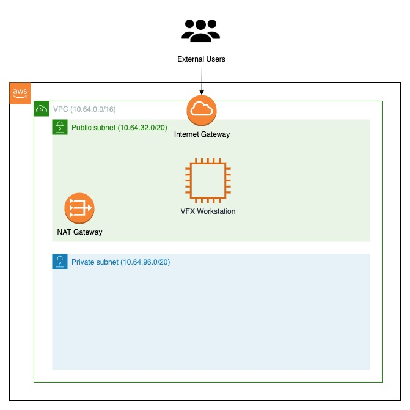

# Content Creation Workstation AWS Sample

Based off the [Creating a Virtual Workstation on AWS](https://studio-in-the-cloud-tutorials.s3-us-west-1.amazonaws.com/streaming-workstation/Creating+a+Virtual+Workstation+on+AWS.pdf), the following CloudFormation template has been created for deploying a Teradic Cloud Access Software on either CentOS 7 or Windows Server 2019 GPU-Enabled EC2 instances. The CloudFormation also provides the ability to provision Client VPN Endpoint if elected during deployment.

Below are architecture diagrams of some deployable configurations. These are not all configurations as the solutions offers ability to chose VPC deployment location (new or existing), subnet (public or private), and Client VPN deployment(true or false). This results in 8 possible deployment combinations.

## Content Creation Workstation deployed in public subnet in a new VPC



## Notes

Teradici CloudAccess Software is accessible using Marketplace AMI which costs $0.50/hr in addition to EC2 computing costs. EBS volumes are encrypted using the default `aws/ebs` KMS key.

## Prerequisites

Please note that the template will be expecting your environment to be configured in the following way prior to running the template.

1. An EC2 Keypair must be created. Click [here](https://docs.aws.amazon.com/AWSEC2/latest/UserGuide/ec2-key-pairs.html) to learn how to create an EC2 Keypair.
2. If deploying to an existing VPC. Ensure that the VPC must have **DNS Hostnames**  and **DNS Support** enabled. For further details click [here](https://docs.aws.amazon.com/vpc/latest/userguide/vpc-dns.html).
3. If deploying a Client VPN endpoint. User must generate a server/client certificate and upload those certificates to AWS Certificate Manager. Click [here](https://docs.aws.amazon.com/vpn/latest/clientvpn-admin/authentication-authorization.html#mutual) to see instructions on how to create server/client certs.

## Deploying the Cloudformation Templates

Please note that the below instructions is how to deploy using the AWS CLI. For more detailed instructions on how to deploy this template, reference the [deployment guide](documentation/Content-Creation-Workstation-Implementation-Guide.pdf).

### 1. Specify correct parameter values for the CloudFormation template

Modify existing parameters file (deployment/parameters/test-param.json) or create your own. Values must be specified for all the following parameters:

  | Parameters                  | Details                                      | Default Value      |
  | --------------------------- |:---------------------------------------------|:-------------------|
  |OSType                  | Specify whether you want to run Teradici on Linux or Windows OS. Allowed values "linux" or "windows". |  linux |
  |EBSVolumeSize           | Volume size for the VFX Host, in GiB | 100 |
  |VFXHostInstanceType     | Amazon EC2 instance type for the VFX workstations. | g4dn.xlarge |
  |KeyPairName             | Name of AWS EC2 Key Pair.  | No Default |
  |VFXHostAccessCIDR       | CIDR Range that will access the VFX Host. Input your network's current public or private IP depending if the VFX is being placed in a public or private subnet | 10.64.0.0/16 |
  |VFXHostSubnetPlacement  | Specify if VFX host should be placed in "Public" or "Private" subnet.    | Public |
  |EnableDeleteProtection  | Specify if VFX host should have delete protection enabled. | false |
  |InstallBlenderSoftware  | Specify if VFX host should download and install Blender software. | true |
  |CreateS3StorageBucket  | Specify if template should create an AWS S3 Bucket and connect the host to sync files between local system and S3 bucket. | true |
  |ExistingVPCID           | If solution should deploy into an existing VPC, Specify existing VPC ID. | 'N/A' |
  |ExistingSubnetID        | If solution should deply into an existing VPN, Specify subnet id in which the VFX Host should be placed in. |'N/A' |
  |VPCCIDR                 | If solution should create a new VPC, specify CIDR Block for the VPC | 10.64.0.0/16 |
  |PublicSubnet1CIDR       | If solution should create a new VPC, specify CIDR Block for the public subnet 1 located in Availability Zone 2   | 10.64.32.0/20  |
  |PrivateSubnet1CIDR      | If solution should create a new VPC, specify CIDR Block for the private subnet 1 located in Availability Zone 2  | 10.64.96.0/20 |
  |EnableVPCFlowLogs      | Specify if newly created VPC should have VPC flow logs enabled. The CloudFormation template will create a new S3 bucket to store the logs. It will also capture ALL logs including ACCEPTS and REJECTS.| false |
  |CreateVPNEndpoint       | Should the CloudFormation create a Client VPN Endpoint. It is recommended if VFX Host is placed in private subnet and there is no other provisions created to connect to private subnet.(Specify 'true' or 'false') | false |
  |ClientCidrBlock         | If creating Client VPN endpoint in the solution, specify the IPv4 address range. It should be in CIDR notation from which to assign client IP addresses. The address range cannot overlap with the local CIDR of the VPC in which the associated subnet is located, or the routes that you add manually. | 10.50.0.0/20 |
  |ServerCertArn           | If creating Client VPN endpoint in the solution, specify Server Cert Arn for VPN endpoint. | 'N/A' |
  |ClientCertificateArn    | If creating Client VPN endpoint in the solution, specify Client Cert Arn for VPN endpoint. | 'N/A' |
  |TargetNetworkCidr       | If creating Client VPN endpoint in the solution, specify the IPv4 address range, in CIDR notation, of the network for which access is being authorized. | 10.64.0.0/16 |

### 2. Prepare the CloudFormation template

Due to the use of Nested Templates in this solution, the parent template must be packaged in order to properly reference the child template(s). More information regarding CloudFormation packaging can be found [here.](https://docs.aws.amazon.com/AWSCloudFormation/latest/UserGuide/using-cfn-cli-package.html)

  Use the following command to package the template:

```bash
aws cloudformation package --template-file ./deployment/content-creation-workstation.template --s3-bucket [desired s3 bucket for CF artifacts] --output-template-file ./deployment/outputs/vfx_packaged.yaml --region [AWS deployment region, should be the same region where S3 bucket is located.]
```

### 3. Create CloudFormation stack

  Use the following command to create the CloudFormation Stack:

```bash
aws cloudformation create-stack --template-body file://deployment/outputs/vfx_packaged.yaml --parameters file://deployment/parameters/test-param.json --stack-name [desired stack name] --region [AWS Deployment Region] --capabilities CAPABILITY_AUTO_EXPAND CAPABILITY_IAM
```
